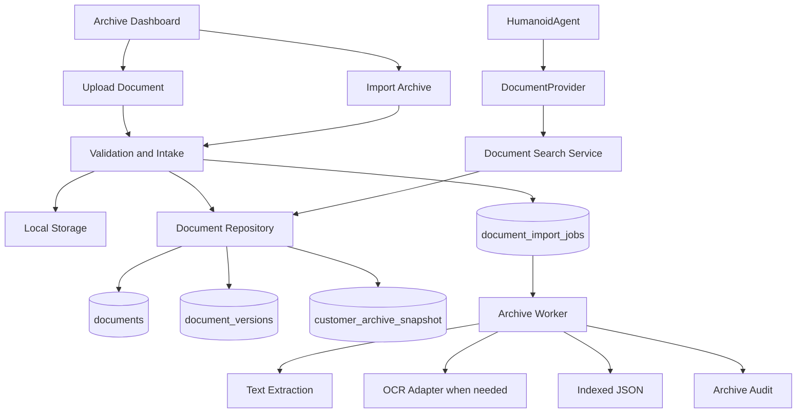

# التصميم المعماري لأرشيف الوثائق المحلي

## حالة الوثيقة

- الحالة: تصميم ومراجعة فقط
- نطاق هذه المرحلة: توثيق معماري دون كود تشغيلي
- لا تتضمن هذه المرحلة Routes أو Migrations أو واجهات مستخدم منفذة
- المصدر الرسمي للوثائق: السيرفر المحلي والتخزين المحلي الدائم
- دور Supabase: فهرسة metadata والربط التشغيلي فقط
- دور المساعد الذكي: مستهلك للوثائق عبر `DocumentProvider` فقط

## 1. الأهداف والحدود

يهدف الأرشيف إلى حفظ العقود وسندات القبض وملفات العملاء والمرفقات لسنوات، مع ضمان قابلية التتبع والاستعادة والبحث.

### قواعد المصدر الرسمي

1. النسخة الأصلية القانونية للوثيقة تحفظ على السيرفر المحلي.
2. لا تحفظ ملفات الوثائق داخل Supabase Storage.
3. لا تحفظ PDF أو الصور أو الملفات الثنائية داخل قاعدة البيانات.
4. تحفظ Supabase بيانات الفهرسة والربط والحالة فقط.
5. لا يقرأ `HumanoidAgent` الملفات مباشرة.
6. لا تعتمد صحة الوثيقة على اسم الملف؛ يعتمد التعريف على `document_id` و`version_id` و`sha256`.
7. لا تستخدم Vector Database أو Embeddings أو Mem0 أو LangChain في هذه المرحلة.

## 2. مسار التأثير



## 3. دورة حياة الوثيقة

```text
received
  -> validated
  -> stored
  -> registered
  -> queued
  -> processing
  -> extracted / needs_ocr
  -> indexed
  -> audited
  -> available
```

الحالات الأساسية:

- `received`: تم استلام الملف ولم تكتمل التحققات.
- `rejected`: فشل التحقق أو نوع الملف غير مقبول.
- `stored`: حفظت النسخة الأصلية محليًا.
- `queued`: أنشئت مهمة للفهرسة الخلفية.
- `processing`: يعمل عليها Worker.
- `indexed`: أنشئ JSON وبيانات البحث.
- `needs_ocr`: الملف يحتاج OCR.
- `failed`: فشلت المعالجة مع حفظ السبب.
- `available`: الوثيقة جاهزة للبحث والوصول.
- `archived`: محفوظة تاريخيًا وغير نشطة افتراضيًا.

لا يعني فشل الفهرسة فقدان PDF الأصلي. تبقى النسخة الأصلية محفوظة ويمكن إعادة الفهرسة لاحقًا.

## 4. أنواع مصادر الإدخال

### Upload Document

رفع ملف منفرد لأحد الأنواع التالية:

- عقد
- سند قبض
- مرفق
- مستند عميل

المسار:

```text
Upload Document
  -> Validation
  -> SHA-256
  -> Local Storage
  -> Document Registration
  -> Job Queue
  -> Indexing
  -> Audit
```

### Import Archive

رفع جماعي لأحد الخيارات التالية:

- مجموعة PDF.
- ZIP Archive.
- أرشيف عقود قديم.
- أرشيف سندات قبض قديم.

قواعد ZIP:

- قبول الملفات المسموح بها فقط.
- رفض الملفات التنفيذية والمجهولة.
- منع `path traversal` مثل `../`.
- تحديد أقصى حجم للملف المضغوط.
- تحديد أقصى عدد للملفات.
- استخراج إلى مجلد مؤقت معزول.
- تسجيل نتيجة كل ملف على حدة.
- عدم اعتبار فشل ملف واحد فشلًا للأرشيف كاملًا.

المساران يستخدمان نفس خدمة الإدخال الداخلية، ولا يوجد مسار معالجة منفصل يتجاوز التحقق أو التسجيل.

## 5. هيكل التخزين المحلي

يحدد الجذر عبر متغير بيئة خارج المشروع:

```text
ARCHIVE_STORAGE_ROOT=/srv/al-muhtaraz-storage
```

الهيكل المقترح:

```text
/srv/al-muhtaraz-storage/
├── contracts/
│   ├── pdf/
│   └── json/
├── receipts/
│   ├── pdf/
│   └── json/
├── customers/
├── attachments/
├── imports/
│   ├── incoming/
│   ├── processing/
│   ├── completed/
│   └── failed/
├── backups/
│   ├── manifests/
│   └── snapshots/
└── quarantine/
```

### قواعد المسارات

- لا يبنى مسار التخزين مباشرة من اسم الملف القادم من المستخدم.
- تستخدم معرفات داخلية آمنة مع امتداد معروف.
- يحتفظ باسم الملف الأصلي كـ metadata فقط.
- يمنع الوصول العام المباشر إلى مجلد التخزين.
- التنزيل يتم عبر `DocumentProvider` وطبقة الصلاحيات.
- يمنع استخدام `public/` لتخزين الوثائق القانونية.

## 6. نموذج الوثائق والإصدارات

### documents

يمثل الهوية المنطقية للوثيقة:

- `id`
- `document_type`
- `customer_id`
- `contract_id`
- `current_version_id`
- `status`
- `created_at`
- `updated_at`

### document_versions

يمثل كل ملف فعلي وإصدار مستقل:

- `id`
- `document_id`
- `version_number`
- `file_path`
- `json_path`
- `original_filename`
- `mime_type`
- `file_size`
- `sha256`
- `content_type`: `pdf_text`, `pdf_scan`, `image`
- `extraction_status`
- `ocr_status`
- `extraction_error`
- `created_at`

قواعد الإصدار:

- لا يستبدل الإصدار السابق.
- كل تعديل ينشئ `document_versions` جديدًا.
- `current_version_id` يشير إلى الإصدار الحالي فقط.
- الإصدارات القديمة تبقى قابلة للقراءة والتدقيق.
- يمنع تكرار نفس `sha256` لنفس الوثيقة.
- اسم الملف ليس مفتاحًا ولا مرجعًا وحيدًا.

أمثلة أسماء بشرية ممكنة:

```text
CTR-1001-v1.pdf
CTR-1001-v2.pdf
```

لكن الهوية الفعلية هي:

```text
(document_id, version_id, sha256)
```

## 7. customer_archive_snapshot

يحفظ نسخة ثابتة من بيانات العميل في لحظة الأرشفة، ولا يعتمد على القراءة المستقبلية من `customers` وحدها.

الحقول المقترحة:

- `id`
- `customer_id`
- `document_id`
- `name`
- `phone`
- `alt_phone`
- `customer_type`
- `address`
- `notes`
- `captured_at`

الهدف:

- حفظ اسم العميل وقت إصدار الوثيقة.
- حفظ رقم الجوال التاريخي.
- حماية الوثائق من تغييرات بيانات التشغيل الحالية.
- تمكين عرض الوثيقة حتى عند حذف أو تعديل سجل العميل التشغيلي، وفق سياسة الاحتفاظ.

## 8. Queue وWorker

لا تعالج دفعة من آلاف الملفات داخل Route واحد.

### document_import_jobs

الحقول المقترحة:

- `id`
- `document_id`
- `source_type`
- `source_path`
- `status`
- `priority`
- `attempts`
- `max_attempts`
- `last_error`
- `locked_at`
- `worker_id`
- `started_at`
- `completed_at`
- `created_at`
- `updated_at`

### التصميم التشغيلي

```text
Next.js API
  -> validates and stores the file
  -> registers document metadata
  -> creates queued job
  -> returns job id

Archive Worker
  -> claims one job with a lock
  -> extracts text or invokes OCR adapter
  -> writes JSON atomically
  -> updates job and document status
  -> emits audit events
```

### قواعد Worker

- يعمل كعملية مستقلة على السيرفر المحلي.
- لا يعتمد على بقاء طلب HTTP مفتوحًا.
- يستخدم قفلًا لمنع تنفيذ المهمة مرتين.
- يدعم retry محدودًا.
- يصنف الأخطاء إلى قابلة لإعادة المحاولة وغير قابلة لها.
- لا يحذف PDF عند فشل الفهرسة.
- يدعم الإيقاف الآمن واستكمال العمل.
- يسجل `correlationId` و`jobId` في كل حدث.

## 9. استخراج النص وOCR Adapter

يدعم التصميم منذ البداية ثلاثة أنواع:

```text
pdf_text
pdf_scan
image
```

### Text Extraction

إذا احتوى PDF على نص قابل للاستخراج:

1. استخراج النص.
2. تنظيف النص.
3. استخراج الحقول المعروفة إن أمكن.
4. إنشاء JSON.
5. حساب جودة الاستخراج.

### OCR

إذا كان PDF ممسوحًا أو الملف صورة:

- يحول إلى `needs_ocr`.
- يمر عبر واجهة `OcrProvider`.
- لا يرتبط الوكيل بمكتبة OCR معينة.
- يمكن إضافة مزود محلي لاحقًا دون تغيير دورة الأرشيف.

العقد المقترح:

```ts
interface OcrProvider {
  canProcess(input: OcrInput): boolean;
  extractText(input: OcrInput): Promise<ExtractionResult>;
}
```

تعطل OCR لا يؤدي إلى فقدان الملف الأصلي؛ يبقى في حالة `needs_ocr` أو `failed` مع إمكانية إعادة المحاولة.

## 10. JSON المفهرس

ينشأ JSON بجانب كل إصدار PDF، ويحتوي على الأقل على:

- `documentId`
- `versionId`
- `documentType`
- `contractNumber`
- `receiptNumber`
- `customerId`
- `customerSnapshot`
- `customerName`
- `customerPhone`
- `containerNumber`
- `startDate`
- `endDate`
- `fullText`
- `contentType`
- `extractionStatus`
- `ocrStatus`
- `sha256`
- `indexedAt`

JSON نسخة بحث وفهرسة، وليس بديلًا عن PDF الأصلي.

## 11. البحث

`DocumentSearchService` يدعم في المرحلة الأولى:

- رقم العقد.
- رقم السند.
- اسم العميل.
- رقم الجوال.
- رقم الحاوية.
- النص الكامل.
- نوع الوثيقة.
- حالة الفهرسة.

لا تستخدم هذه المرحلة:

- Vector Database.
- Embeddings.
- Qdrant.
- Chroma.
- Semantic Search.

يمكن إضافة هذه التقنيات لاحقًا كـ adapters فوق نفس الوثائق وJSON دون تغيير التخزين الأصلي.

## 12. DocumentProvider

هو الحد الوحيد الذي يراه المساعد الذكي للوصول إلى الأرشيف.

```ts
interface DocumentProvider {
  search(input: DocumentSearchInput): Promise<DocumentSearchResult[]>;
  getDocument(id: string): Promise<ArchivedDocument | null>;
  getContract(contractId: string): Promise<ArchivedDocument[] >;
}
```

### DocumentProvider Contract

هذا هو العقد المعتمد الذي تستخدمه لاحقًا واجهة `Archive Dashboard` و`DocumentSearchService` و`HumanoidAgent`، دون كشف طريقة التخزين أو الفهرسة:

```ts
interface DocumentProvider {
  search(query: SearchQuery): Promise<SearchResult[]>;
  getDocument(id: string): Promise<ArchivedDocument | null>;
  getVersions(documentId: string): Promise<ArchiveDocumentVersion[]>;
  getContent(documentId: string): Promise<string>;
}
```

قواعد العقد:

- `search` يعيد نتائج metadata وفهرسة، ولا يقرأ PDF كاملًا عند كل بحث.
- `getDocument` يعيد هوية الوثيقة وحالتها وبياناتها المرتبطة.
- `getVersions` يعيد سجل الإصدارات دون حذف الإصدارات السابقة.
- `getContent` يعيد المحتوى المفهرس أو النص المستخرج، وليس مسار الملف المحلي.
- لا يكشف العقد `ARCHIVE_STORAGE_ROOT` أو `file_path` الداخلي.
- يمكن تبديل التخزين المحلي أو محرك الفهرسة أو إضافة بحث دلالي لاحقًا دون تعديل Dashboard أو Search أو HumanoidAgent.

الطبقات:

```text
DocumentProvider
  -> DocumentSearchService
    -> DocumentRepository
      -> Supabase metadata
      -> Local Storage Service
```

### سياسة منع القراءة المباشرة

- يمنع `HumanoidAgent` من استيراد `fs` أو `path` الخاص بالأرشيف.
- يمنع Routes وComponents من بناء مسارات الملفات يدويًا.
- يمنع قراءة PDF مباشرة من Supabase أو local filesystem خارج الخدمة.
- كل قراءة تمر عبر `DocumentProvider` مع تحقق الصلاحية والتسجيل.
- PDF يعاد كـ stream أو reference آمن حسب نوع العملية، وليس كمسار داخلي خام.

## 13. دمج HumanoidAgent

العلاقة المعتمدة:

```text
HumanoidAgent
  -> DocumentProvider
    -> DocumentSearchService
      -> DocumentRepository
        -> documents / document_versions
        -> local storage
```

أمثلة لاحقة:

- سؤال عن عقد: `DocumentProvider.search()`.
- طلب وثيقة محددة: `DocumentProvider.getDocument()`.
- طلب أرشيف عميل: `DocumentProvider.search({ customerId })`.

لا يعرف `HumanoidAgent`:

- مكان التخزين.
- اسم الملف الحقيقي.
- طريقة استخراج النص.
- مزود OCR.
- نوع قاعدة البيانات.
- محرك البحث المستقبلي.

فشل الأرشيف يجب أن ينتج ردًا مفهومًا مع fallback، ولا يسقط النظام الأساسي أو واجهة المحادثة.

## 14. Archive Dashboard

واجهة مراقبة مستقلة للأرشيف، وليست جزءًا من شاشة العقود التشغيلية في البداية.

### مؤشرات أساسية

- عدد الوثائق الكلي.
- عدد الإصدارات.
- عدد المهام المنتظرة.
- عدد المهام قيد المعالجة.
- عدد الملفات المفهرسة.
- عدد الملفات التي تحتاج OCR.
- عدد الملفات الفاشلة.
- آخر أخطاء Worker.
- آخر وقت Backup ناجح.
- نسبة سلامة الملفات حسب manifest.

### عمليات متوقعة

- إعادة محاولة مهمة فاشلة.
- إعادة فهرسة وثيقة.
- عرض إصدارات الوثيقة.
- عرض نتيجة التدقيق.
- بدء Backup يدوي بصلاحية مناسبة.
- عرض تقرير Import Archive.

لا يسمح Dashboard بقراءة الملفات الخام مباشرة؛ يستخدم خدمات الأرشيف نفسها.

## 15. النسخ الاحتياطي والاستعادة

`ArchiveBackupService` خدمة مستقلة مسؤولة عن:

1. إنشاء snapshot متسق.
2. نسخ PDF وJSON والـ manifest.
3. حساب والتحقق من `sha256`.
4. تسجيل وقت وحالة النسخ.
5. اختبار قابلية القراءة.
6. الاستعادة إلى مساحة مؤقتة.
7. التحقق قبل التفعيل.

### Manifest

كل Backup يحتوي manifest يتضمن:

- `backupId`
- `createdAt`
- `sourceRoot`
- `fileCount`
- `totalBytes`
- قائمة المسارات المنطقية.
- أحجام الملفات.
- `sha256` لكل ملف.

الاستعادة لا تستبدل الأرشيف الحالي مباشرة. تستخدم منطقة staging، ثم تفعيلًا ذريًا بعد نجاح التحقق.

## 16. Audit والجودة

يسجل Audit:

- من رفع الوثيقة.
- مصدرها: منفرد أو ZIP.
- وقت الحفظ.
- نتيجة التحقق.
- نتيجة استخراج النص.
- هل احتاجت OCR.
- نتيجة حساب SHA-256.
- تغييرات الإصدار.
- أخطاء Worker.
- عمليات التنزيل أو الوصول الحساسة.
- نتائج Backup وRestore.

مؤشرات الجودة:

- نسبة الملفات القابلة للفتح.
- نسبة الملفات المفهرسة.
- نسبة الملفات التي تحتاج OCR.
- نسبة نجاح OCR.
- الملفات المكررة.
- الملفات التي لا ترتبط بعقد أو عميل.
- الفروقات بين manifest والملفات الفعلية.

## 17. سياسة الصلاحيات (Archive Permissions)

الأرشيف القانوني لا يستخدم صلاحيات التطبيق العامة تلقائيًا. يجب أن تمر كل عملية عبر طبقة صلاحيات الأرشيف، مع تسجيل `userId` و`role` و`documentId` و`correlationId`.

### الأدوار

- `Archive Admin`: مسؤول النظام والأرشيف. يملك الإدارة الكاملة، بما في ذلك الحذف المنطقي، إدارة الإصدارات، وإدارة الاستعادة.
- `Archive Manager`: يدير الإدخال والفهرسة والمراجعة اليومية، دون حذف الوثائق أو تغيير سجلها القانوني.
- `Employee`: يرفع الوثائق المسموح بها ويبحث فيها، مع تقييد التحميل بحسب العقود والصلاحيات المرتبطة به.
- `AI Agent`: مستهلك للبحث والبيانات المفهرسة فقط. لا يرفع أو يحذف أو يعيد الفهرسة أو يصل إلى الملفات الخام مباشرة.

### مصفوفة العمليات

| العملية | Archive Admin | Archive Manager | Employee | AI Agent |
|---|---:|---:|---:|---:|
| رفع ملف | نعم | نعم | نعم ضمن الصلاحية | لا |
| حذف وثيقة | نعم، حذف منطقي فقط | لا | لا | لا |
| البحث | نعم | نعم | نعم ضمن النطاق | نعم عبر `DocumentProvider` |
| تحميل أصل الوثيقة | نعم | نعم | حسب الصلاحية والنطاق | حسب الصلاحية ومن خلال `DocumentProvider` |
| إعادة الفهرسة | نعم | نعم | لا | لا |
| إدارة الإصدارات | نعم | مراجعة فقط | لا | لا |
| بدء Backup أو Restore | نعم | لا | لا | لا |
| عرض Audit | نعم | نعم ضمن النطاق | لا | لا |

### ضوابط إضافية

- لا يساوي البحث حق تحميل الأصل.
- لا يساوي رفع وثيقة حق تعديل أو حذف وثيقة سابقة.
- التحميل يعيد stream أو رابطًا مؤقتًا آمنًا، ولا يكشف المسار المحلي.
- صلاحيات `AI Agent` للقراءة المنظمة فقط، ولا تسمح بإنشاء تعليمات تشغيلية أو تنفيذ عمليات أرشيفية.
- كل رفض صلاحية يسجل كحدث أمني مصنف، دون كشف مسارات أو بيانات حساسة.
- عمليات `delete` و`restore` و`reindex` الإدارية تحتاج تسجيلًا تدقيقيًا واضحًا.

## 18. سياسة الاحتفاظ بالوثائق (Retention Policy)

الأرشيف مرجع قانوني وتاريخي، لذلك لا يعتمد الحذف الفيزيائي كعملية تشغيلية عادية.

### القواعد الأساسية

- العقود: لا تحذف نهائيًا.
- سندات القبض: لا تحذف نهائيًا.
- نسخ العقود والإصدارات السابقة: لا تحذف نهائيًا.
- لقطات بيانات العملاء المرتبطة بالوثائق: تحفظ مع الوثيقة وفق سياسة الاحتفاظ القانونية.
- المرفقات: يمكن نقلها إلى حالة أرشيفية، ولا تحذف تلقائيًا.
- ملفات الاستيراد المؤقتة: يمكن تنظيفها بعد نجاح التحقق والفهرسة وتسجيل النتيجة.
- الملفات المرفوضة أو التالفة: تنقل إلى `quarantine` أو حالة فشل، ولا تحذف قبل انتهاء مدة مراجعة محددة.

### معنى الحذف

في نظام الأرشيف:

```text
Delete = Archived / Logically Retired
```

ولا يعني ذلك حذف PDF أو JSON أو سجل الإصدارات من التخزين المحلي. يستخدم الحذف المنطقي فقط لمنع الظهور في البحث التشغيلي، مع بقاء الوثيقة قابلة للتدقيق والاستعادة وفق الصلاحيات.

### حالات الاحتفاظ

- `active`: الوثيقة ظاهرة في البحث التشغيلي.
- `archived`: الوثيقة محفوظة لكنها غير ظاهرة في النتائج الافتراضية.
- `legal_hold`: يمنع أي تغيير أو أرشفة إضافية حتى رفع الحجز القانوني.
- `quarantined`: ملف مشكوك فيه أو تالف أو غير مكتمل، بانتظار المراجعة.

### متطلبات التدقيق

كل تغيير في حالة الاحتفاظ يسجل:

- هوية المنفذ.
- الدور والصلاحية.
- سبب التغيير.
- وقت التغيير.
- `documentId` و`versionId`.
- `correlationId`.

لا يسمح بعملية حذف نهائي من Dashboard أو API الاعتيادي. إن فرضت متطلبات قانونية أو تشغيلية استثناءً مستقبلاً، فيجب أن يكون عبر إجراء إداري منفصل بموافقة مزدوجة، وتوثيق كامل، ونسخة Backup سابقة.

## 19. AI Agent Permissions & Action Framework

صلاحية `AI Agent` مبدأ معماري مستقل، وليست تنفيذًا فعليًا في المرحلة الحالية. يظل المساعد الآن في وضع المستشار، ولا يتحول إلى وكيل تنفيذي إلا عبر أدوات مسجلة وصلاحيات صريحة وسير موافقة.

### وضع المستشار (Consultant Mode)

في الوضع الحالي يستطيع المساعد:

- البحث في الوثائق والبيانات المسموح بها.
- قراءة العقود والسندات وملخصاتها.
- تحليل البيانات وإعداد التقارير.
- اقتراح الإجراءات التالية.

ولا يستطيع مباشرة:

- تعديل البيانات.
- حذف الوثائق أو العملاء أو العقود.
- إرسال رسائل WhatsApp.
- إنشاء فواتير أو اعتماد دفعات.
- إنشاء عقد قابل للاعتماد.

### وضع الوكيل التنفيذي (Executive Agent Mode)

إذا تم تفعيله مستقبلًا، تمر كل عملية عبر المسار التالي:

```text
HumanoidAgent
  -> PermissionEngine
    -> ToolRegistry
      -> ActionExecutor
        -> Domain Service
          -> AuditTrail
```

الطبقات المقترحة:

```text
src/services/agent/
├── toolRegistry.ts
├── permissionEngine.ts
├── actionExecutor.ts
├── approvalWorkflow.ts
└── auditTrail.ts
```

- `PermissionEngine`: يقرر هل العملية مسموحة للدور والسياق الحالي.
- `ToolRegistry`: يسجل الأدوات المسموح بها، ومخاطرها، ومدخلاتها، وخدمتها المالكة.
- `ActionExecutor`: ينفذ الأداة بعد اجتياز التحقق، ولا يستدعي مزودًا خارجيًا مباشرة.
- `ApprovalWorkflow`: ينشئ طلب موافقة للعمليات التي لا تنفذ تلقائيًا.
- `AuditTrail`: يسجل الطلب، القرار، المنفذ، النتيجة، والارتباطات التشغيلية.

### تصنيف عمليات المساعد

| التصنيف | أمثلة | سياسة التنفيذ |
|---|---|---|
| `read` | البحث، قراءة عقد، قراءة سند، تلخيص | مسموح في نطاق الصلاحية |
| `report` | تقرير مالي أو تقرير أرشيف | مسموح مع تسجيل العملية |
| `draft` | تجهيز مسودة عقد أو رسالة | مسموح، ولا يعتمد الناتج تلقائيًا |
| `notify` | إرسال WhatsApp أو إشعار | يحتاج موافقة صريحة قبل الإرسال |
| `write` | إنشاء أو تعديل عقد أو رفع وثيقة | يحتاج موافقة وسياق مستخدم واضح |
| `financial` | إنشاء فاتورة أو بدء إجراء مالي | يحتاج موافقة بشرية وصلاحية مالية |
| `destructive` | حذف أو إتلاف وثيقة أو سجل | ممنوع على AI Agent |

### مصفوفة صلاحيات AI Agent

#### مسموح دون موافقة

- قراءة العقود والعملاء والوثائق ضمن نطاق المستخدم.
- البحث برقم العقد أو العميل أو الجوال أو الحاوية.
- تلخيص الوثائق والبيانات.
- إعداد التقارير غير المعدلة للبيانات.
- اقتراح إجراء أو تجهيز مسودة غير معتمدة.

#### يحتاج موافقة بشرية

- إرسال نسخة للعميل عبر WhatsApp.
- إنشاء عقد جديد أو مسودة تجديد قابلة للتحويل إلى عقد.
- تعديل عقد أو بيانات عميل.
- رفع وثيقة أو استيراد أرشيف.
- إعادة فهرسة وثيقة أو دفعة.
- إنشاء فاتورة أو بدء إجراء مالي.

#### ممنوع نهائيًا

- حذف وثيقة أو إصدار أرشيفي.
- حذف عميل أو عقد.
- تجاوز `legal_hold` أو سياسة الاحتفاظ.
- اعتماد دفعة أو تغيير حالة مالية دون موافقة بشرية.
- تغيير الصلاحيات أو إعدادات الأرشيف.
- الوصول إلى مسارات الملفات المحلية مباشرة.
- استدعاء أدوات غير مسجلة في `ToolRegistry`.

### متطلبات Audit Trail

كل عملية ينفذها أو يقترحها المساعد تسجل:

- `correlationId` و`requestId`.
- `userId` ودور المستخدم.
- وضع المساعد: مستشار أو وكيل تنفيذي.
- اسم الأداة وتصنيف المخاطر.
- المدخلات المنقحة من الأسرار.
- قرار الصلاحية ورقم طلب الموافقة إن وجد.
- الوثائق أو العقود المتأثرة.
- النتيجة أو الخطأ المصنف.
- وقت البدء والانتهاء.

لا تسجل الأسرار أو مفاتيح الخدمات أو محتوى غير ضروري من وثائق العملاء داخل سجل الأحداث.

### قواعد العزل

- قاعدة إلزامية: `AI Agent` لا يصل مباشرة إلى `Database` أو `Local Storage` أو `File Paths`.
- المسار الوحيد للوصول إلى الأرشيف هو:

```text
AI Agent
  -> Tool Registry
    -> DocumentProvider
      -> Services
```

- يمنع `AI Agent` من استيراد عميل قاعدة البيانات أو `fs` أو `path` أو بناء مسارات الملفات.
- يمنع `AI Agent` من تنفيذ استعلامات أو عمليات تخزين حتى لو كانت للقراءة خارج الأدوات المسجلة.
- `DocumentProvider` يظل واجهة القراءة الرسمية للأرشيف.
- `ContractService` يملك عمليات العقود.
- `CustomerService` يملك عمليات العملاء.
- `WhatsAppService` يملك الإرسال الخارجي.
- `PaymentService` يملك العمليات المالية.
- `ArchiveService` يملك الرفع وإعادة الفهرسة والنسخ الاحتياطي.
- لا يستورد `HumanoidAgent` هذه الخدمات التنفيذية مباشرة دون `ToolRegistry` و`PermissionEngine`.

هذا الفصل يحدد حدود التصميم فقط، ولا يمنح المساعد صلاحيات تنفيذية فعلية قبل اعتماد مرحلة التنفيذ الخاصة بها.

## 20. تكامل العقود والسندات الحالية

لا تعدل هذه المرحلة الجداول الحالية أو منطقها.

نقاط الدمج المستقبلية:

```text
Contract created
  -> generate/archive official PDF
  -> create customer snapshot
  -> register document version
  -> queue indexing
```

```text
Receipt created
  -> generate/archive receipt PDF
  -> create customer snapshot
  -> register document version
  -> queue indexing
```

المصادر الحالية مثل `localStorage` وBase64 داخل QR تعتبر مصادر انتقالية أو للعرض فقط، وليست مصدر الأرشيف الرسمي.

## 21. الملفات المتوقع إنشاؤها في مراحل لاحقة

هذه قائمة تصميمية وليست ملفات منفذة الآن:

```text
supabase/migrations/001_create_archive_documents.sql
src/services/archive/types.ts
src/services/archive/storage/localStorageService.ts
src/services/archive/documents/documentRepository.ts
src/services/archive/documents/documentService.ts
src/services/archive/import/documentImportService.ts
src/services/archive/import/zipImportService.ts
src/services/archive/queue/documentJobQueue.ts
src/services/archive/queue/documentWorker.ts
src/services/archive/indexing/documentIndexer.ts
src/services/archive/indexing/textExtractor.ts
src/services/archive/indexing/ocrProvider.ts
src/services/archive/search/documentSearchService.ts
src/services/archive/provider/documentProvider.ts
src/services/archive/backup/archiveBackupService.ts
src/services/archive/audit/documentAuditService.ts
src/app/api/archive/upload/route.ts
src/app/api/archive/import/route.ts
src/app/api/archive/documents/[id]/route.ts
src/app/api/archive/search/route.ts
src/app/api/archive/reindex/route.ts
src/app/api/archive/audit/route.ts
```

## 22. مراحل التنفيذ بعد اعتماد الوثيقة

### المرحلة 1: التصميم والمراجعة

- هذه الوثيقة فقط.
- لا Migration.
- لا Routes.
- لا واجهات منفذة.
- لا تعديل في Supabase.

### المرحلة 2: Migration مستقلة

- إنشاء الجداول الجديدة فقط.
- إضافة القيود والفهارس.
- عدم تعديل جداول `contracts` أو `customers` أو `receipts`.

### المرحلة 3: Local Storage Service

- إنشاء المجلدات.
- حماية المسارات.
- الحفظ الذري.
- SHA-256.

### المرحلة 4: Import Service وText Indexing

- إدخال ملف PDF منفرد برمجيًا.
- التحقق والحفظ وإنشاء JSON.
- تصنيف PDF النصي أو الممسوح إلى `needs_ocr`.
- اختبار منع التكرار وتحديث الحالات.

### المرحلة 5: Queue وWorker

- تفعيل `document_import_jobs` كطابور فعلي.
- إنشاء Worker مستقل على السيرفر المحلي.
- locking وretry واستئناف المهام بعد التوقف.
- معالجة دفعات ZIP الكبيرة خارج دورة طلب HTTP.
- ربط Backup وAudit بدورة المعالجة دون فقدان الأصل.

### المرحلة 6: واجهة الأرشيف والبحث

- واجهة `Upload Document` للرفع المنفرد.
- واجهة `Import Archive` للرفع الجماعي وZIP.
- `Archive Dashboard` لمراقبة الحالات والإصدارات والأخطاء.
- `DocumentSearchService` للبحث النصي برقم العقد والعميل والجوال والحاوية.
- `DocumentProvider` كواجهة الوصول الموحدة.
- منع القراءة المباشرة للملفات من Routes وComponents والمساعد.

### المرحلة 7: OCR

- تفعيل `OcrProvider` كـAdapter قابل للاستبدال.
- معالجة PDF الممسوح والصور.
- إعادة المهام من `needs_ocr` إلى `indexed` عند النجاح.
- تسجيل جودة الاستخراج وفشل OCR.
- عدم حذف PDF الأصلي عند فشل OCR.

### المرحلة 8: دمج المساعد الذكي

- ربط `HumanoidAgent` بـ `DocumentProvider` فقط.
- إضافة أدوات قراءة أرشيفية مسجلة.
- تطبيق `PermissionEngine` و`ToolRegistry` قبل أي إجراء تنفيذي.
- بدء المساعد في المستوى `L1` للقراءة والبحث فقط.
- تمرير `correlationId` إلى البحث والأحداث.
- fallback آمن عند تعطل الأرشيف أو البحث.
- منع الوصول المباشر إلى PDF أو مسارات التخزين.

## 23. مستويات حركة المساعد داخل التطبيق

تفعيل صلاحيات المساعد تدريجيًا، ولا ينتقل إلى مستوى أعلى دون اختبارات وموافقة صريحة.

| المستوى | الصلاحية | أمثلة | الحالة الافتراضية |
|---|---|---|---|
| `L1` | قراءة وبحث فقط | البحث، قراءة الوثائق، التلخيص، التقارير | مفعّل عند الدمج الأول |
| `L2` | إنشاء مسودات وتقارير | مسودة عقد، مسودة رسالة، تقرير قابل للمراجعة | يتطلب تفعيلًا منفصلًا |
| `L3` | تنفيذ بعد موافقة المستخدم | إرسال WhatsApp، رفع وثيقة، تعديل عقد، إعادة فهرسة | موافقة صريحة لكل عملية |
| `L4` | تنفيذ تلقائي محدود | إجراءات منخفضة المخاطر وفق سياسات ثابتة | معطل افتراضيًا ومقيد بالسياسات |

### قواعد الانتقال بين المستويات

- لا يملك `AI Agent` صلاحية حذف الوثائق أو العملاء أو العقود في أي مستوى.
- لا يتجاوز المساعد `legal_hold` أو سياسة الاحتفاظ.
- `L2` لا يغير بيانات التشغيل؛ ينتج مخرجات قابلة للمراجعة فقط.
- `L3` يحتاج هوية المستخدم، الصلاحية، وطلب موافقة قابلًا للتدقيق.
- `L4` لا يفعّل إلا بعد تحديد قائمة عمليات مسموحة وحدود معدل وتنبيهات وفترة مراجعة.
- كل عملية تسجل `correlationId` واسم الأداة والمستوى وقرار الصلاحية والنتيجة.
- فشل Permission Engine أو Approval Workflow يؤدي إلى رفض آمن، وليس تنفيذًا تلقائيًا.

## 24. Tool Registry Policy

كل أداة يمكن أن يستخدمها المساعد يجب أن تسجل في `ToolRegistry` قبل إتاحتها، ولا يسمح باستدعاء أدوات غير معرفة في السجل.

### تعريف الأداة الإلزامي

```ts
interface RegisteredAgentTool {
  toolName: string;
  description: string;
  requiredPermissionLevel: 'L1' | 'L2' | 'L3' | 'L4' | 'Forbidden';
  requiresApproval: boolean;
  auditRequired: boolean;
}
```

### سياسة الأدوات

| Tool Name | Required Permission Level | Requires Approval | Audit Required | السياسة |
|---|---:|---:|---:|---|
| `searchDocuments` | `L1` | لا | اختياري | بحث وقراءة metadata عبر `DocumentProvider` |
| `getDocumentContent` | `L1` | لا | اختياري | قراءة المحتوى المفهرس دون كشف المسار المحلي |
| `generateArchiveReport` | `L2` | لا | نعم | إنشاء تقرير قابل للمراجعة ولا يعدل البيانات |
| `draftContractRenewal` | `L2` | لا | نعم | إنشاء مسودة غير معتمدة |
| `sendCustomerNotification` | `L3` | نعم | نعم | إرسال بعد موافقة المستخدم الصريحة |
| `uploadArchiveDocument` | `L3` | نعم | نعم | رفع وثيقة بعد التحقق والموافقة |
| `reindexDocument` | `L3` | نعم | نعم | إعادة فهرسة وثيقة محددة |
| `deleteDocument` | `Forbidden` | غير مسموح | نعم عند محاولة الرفض | ممنوع نهائيًا على المساعد |

### قواعد التسجيل والتنفيذ

- اسم الأداة فريد وثابت ولا يعتمد على نص النموذج.
- الوصف يحدد المدخلات والنتيجة والمخاطر وحدود النطاق.
- `requiredPermissionLevel` هو الحد الأدنى، ولا تخفضه الأداة وقت التنفيذ.
- `requiresApproval = true` يعني أن الطلب لا ينفذ قبل وجود موافقة مرتبطة بـ`requestId`.
- `auditRequired = true` يفرض تسجيل البداية والقرار والنتيجة والخطأ إن وجد.
- الأدوات `Forbidden` لا تسجل كأدوات قابلة للتنفيذ؛ تسجل محاولة الرفض فقط عند الحاجة الأمنية.
- تسجيل التدقيق لا يحفظ أسرارًا أو مسارات محلية أو محتوى وثائق غير لازم.
- أي فشل في التحقق من تعريف الأداة أو صلاحيتها يؤدي إلى رفض آمن.

كل مرحلة تنفذ بشكل محدود، تختبر محليًا، تراجع، ثم تحفظ في Commit مستقل مع نقطة استعادة عند الحاجة.

## 25. معايير القبول

لا تعتبر البنية جاهزة قبل تحقق الآتي:

- PDF الأصلي محفوظ محليًا ويمكن استعادته.
- Supabase تحتوي metadata فقط.
- كل وثيقة لها هوية مستقلة عن اسم الملف.
- الإصدارات القديمة لا تحذف.
- SHA-256 يمنع التكرار ويتحقق من السلامة.
- Import Archive لا يعالج كل الملفات داخل طلب واحد.
- Worker يستأنف العمل بعد التوقف.
- فشل OCR لا يفقد الأصل.
- Backup قابل للتحقق والاستعادة.
- البحث لا يقرأ PDF عند كل استعلام.
- المساعد يصل عبر `DocumentProvider` فقط.
- تعطل الأرشيف لا يسقط النظام التشغيلي أو المساعد.

## 26. قرار هذه المرحلة

هذه الوثيقة هي التصميم المرجعي للمرحلة القادمة. لا يبدأ تنفيذ Migration أو Routes أو واجهة الرفع أو تعديل قاعدة البيانات قبل مراجعة الوثيقة واعتمادها صراحة.
