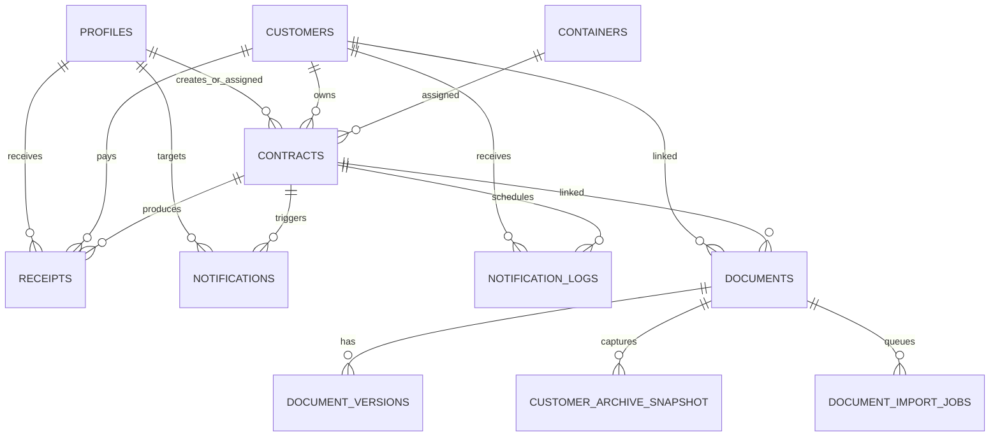

# تقرير المرحلة الثانية: تصميم قاعدة بيانات الأرشيف والتخزين المحلي

## حالة التقرير

- المرحلة: الثانية، تحليل وتصميم فقط
- الحالة: جاهز للمراجعة قبل إنشاء Migration
- لا توجد Migration فعلية في هذا التقرير
- لم يتم تعديل `schema.sql`
- لم يتم تعديل `package.json` أو `next.config.js`
- لم يتم إنشاء Routes أو Services أو واجهات
- لم يتم تعديل أي جدول تشغيلي حالي

## 1. القرار المعماري

السيرفر المحلي هو المصدر الرسمي الوحيد للملفات القانونية:

- PDF والصور والمرفقات تحفظ على التخزين المحلي الدائم.
- Supabase تحفظ metadata والفهرسة والروابط المنطقية والحالات فقط.
- لا تستخدم Supabase Storage لحفظ الوثائق.
- لا تحفظ ملفات ثنائية داخل PostgreSQL.
- لا يقرأ أي Route أو Component أو `HumanoidAgent` الملفات مباشرة.
- الوصول إلى الملف يمر مستقبلًا عبر `DocumentProvider` وطبقات الأرشيف.

## 2. تحليل الجداول الحالية

### `customers`

- المفتاح: `id UUID PRIMARY KEY`.
- الحقول التاريخية المهمة: `name`, `phone`, `alt_phone`, `customer_type`, `address`, `notes`.
- الفهارس الحالية: `phone`, `name`.
- لا يوجد حذف تلقائي عند ارتباط العميل بعقد؛ عقود العملاء تستخدم `ON DELETE RESTRICT`.
- أفضل نقطة ربط: `documents.customer_id` و`customer_archive_snapshot.customer_id`.
- يجب حفظ snapshot مستقل لأن الاسم أو الهاتف قد يتغيران لاحقًا.

### `contracts`

- المفتاح: `id UUID PRIMARY KEY`.
- المفتاح التشغيلي: `contract_number TEXT UNIQUE NOT NULL`.
- يرتبط بـ `customers` عبر `customer_id NOT NULL` و`ON DELETE RESTRICT`.
- يرتبط اختياريًا بـ `containers` عبر `container_id` و`ON DELETE SET NULL`.
- يرتبط اختياريًا بـ `profiles` عبر الموظف المنشئ والموظف المسؤول.
- توجد فهارس للعميل والحاوية والحالة والتواريخ وموعد السحب.
- أفضل نقطة ربط: `documents.contract_id` دون تعديل جدول العقود.
- رقم العقد يصلح للفهرسة والبحث، لكنه ليس مفتاح الوثيقة الداخلي.

### `receipts`

- المفتاح: `id UUID PRIMARY KEY`.
- المفتاح التشغيلي: `receipt_number TEXT UNIQUE NOT NULL`.
- يرتبط بـ `contracts` عبر `contract_id` مع `ON DELETE CASCADE`.
- يرتبط بـ `customers` عبر `customer_id` مع `ON DELETE RESTRICT`.
- يرتبط اختياريًا بالموظف عبر `received_by_employee_id`.
- توجد فهارس للعقد والعميل ورقم السند.
- أفضل نقطة ربط: `documents.document_type = receipt` مع `contract_id` و`customer_id` اختياريين/متحققين.
- يجب ألا يعتمد الأرشيف على بقاء سجل السند التشغيلي وحده.

### `notifications`

- يرتبط بـ `profiles` عبر `user_id` مع `ON DELETE CASCADE`.
- يرتبط بـ `contracts` عبر `contract_id` مع `ON DELETE CASCADE`.
- هو سجل تشغيلي/عرضي وليس مصدرًا قانونيًا للوثائق.
- لا يحتاج إلى Foreign Key مباشر من جداول الأرشيف.
- يمكن تسجيل أحداث الأرشفة في Audit مستقل مستقبلًا بدل إعادة استخدام هذا الجدول.

### `notification_logs`

- يرتبط بـ `contracts` مع `ON DELETE CASCADE`.
- يرتبط بـ `customers` مع `ON DELETE SET NULL`.
- هو سجل رسائل وجدولة، وليس جدول وثائق.
- لا يحتاج إلى ربط مباشر بجداول الأرشيف في Migration الأولى.
- يمكن استخدام `contract_id` لتتبع سبب إنشاء إشعار أرشيفي، لكن ليس لتحديد ملف قانوني.

### `containers`

- المفتاح: `id UUID PRIMARY KEY`.
- المفتاح التشغيلي: `container_number TEXT UNIQUE NOT NULL`.
- يرتبط بالعقود اختياريًا.
- يحتوي على بيانات تشغيلية تتغير، لذلك لا يُنسخ كاملًا إلى snapshot العميل.
- رقم الحاوية يضاف إلى JSON المفهرس عند توفره، دون Foreign Key إلزامي في `documents`.

### `profiles`

- يرتبط بالمستخدمين والموظفين والعقود والإيصالات.
- يوفر أساسًا لاحقًا لصلاحيات الأرشيف وسجل التدقيق.
- لا حاجة إلى إضافة `created_by` إلى كل جدول أرشيفي في الحد الأدنى، لكن يوصى به في `documents` و`document_import_jobs` إذا كان إدخال المستخدم مطلوبًا.

## 3. ملاحظات على `schema.sql`

- الجداول المعرفة صراحة هي: `profiles`, `containers`, `customers`, `contracts`, `notification_logs`, `notifications`, `payment_settings`, `receipts`.
- المخطط يستخدم `whatsapp_settings` في RLS وSeed، لكنه لا يحتوي تعريف `CREATE TABLE` لهذا الجدول داخل الملف.
- هذا يدل على أن المخطط الحالي غير مكتفٍ ذاتيًا أو يعتمد على جدول أُنشئ خارج هذا الملف.
- Migration الأرشيفية لا يجب أن تعتمد على `whatsapp_settings`.
- قبل تطبيق أي Migration مستقبلية يجب التحقق من قاعدة Supabase الفعلية ومقارنة المخطط التطبيقي مع `schema.sql`.
- سياسات RLS الحالية تستخدم `is_admin()` و`is_active_staff()`، وهي نقطة مرجعية لتصميم سياسات الأرشيف لاحقًا.

## 4. ERD مبسط للعلاقات الحالية والأرشيف



العلاقات الجديدة اختيارية من منظور الوثيقة، لأن بعض الملفات القديمة قد لا يمكن ربطها بعقد أو عميل بثقة.

## 5. تصميم الجداول الجديدة

### `documents`

يمثل الهوية المنطقية للوثيقة، وليس الملف الفيزيائي نفسه.

| الحقل | النوع المقترح | القيود/المعنى |
|---|---|---|
| `id` | UUID | PK، `gen_random_uuid()` |
| `document_type` | TEXT | عقد، سند، مرفق، مستند عميل |
| `customer_id` | UUID | FK إلى `customers(id)`، يفضل `ON DELETE SET NULL` |
| `contract_id` | UUID | FK إلى `contracts(id)`، يفضل `ON DELETE SET NULL` |
| `current_version_id` | UUID | يربط بالإصدار الحالي، يضاف بعد إنشاء جدول الإصدارات أو يؤجل |
| `status` | TEXT | `active`, `archived`, `legal_hold`, `quarantined`, `failed` |
| `source_type` | TEXT | `upload`, `zip_import`, `legacy_import`, `generated` |
| `original_filename` | TEXT | اسم العرض فقط، ليس مفتاحًا |
| `created_by` | UUID | FK اختياري إلى `profiles(id)` |
| `created_at` | TIMESTAMPTZ | وقت التسجيل |
| `updated_at` | TIMESTAMPTZ | وقت آخر تحديث |

القيود المقترحة:

- `document_type` ضمن قائمة مغلقة.
- لا يشترط وجود `customer_id` أو `contract_id` للوثائق القديمة.
- لا يستخدم `ON DELETE CASCADE` على الوثائق القانونية.
- الحذف المنطقي فقط.

### `document_versions`

يمثل كل نسخة ملف فعلية.

| الحقل | النوع المقترح | القيود/المعنى |
|---|---|---|
| `id` | UUID | PK |
| `document_id` | UUID | FK إلى `documents(id)` مع `ON DELETE RESTRICT` |
| `version_number` | INTEGER | موجب، يبدأ من 1 |
| `file_path` | TEXT | مسار منطقي داخل `ARCHIVE_STORAGE_ROOT` |
| `json_path` | TEXT | مسار JSON المفهرس |
| `original_filename` | TEXT | الاسم الأصلي للعرض |
| `mime_type` | TEXT | `application/pdf` أو نوع صورة مسموح |
| `file_size` | BIGINT | حجم الملف بالبايت |
| `sha256` | TEXT | قيمة hex بطول 64 |
| `content_type` | TEXT | `pdf_text`, `pdf_scan`, `image` |
| `extraction_status` | TEXT | `pending`, `completed`, `failed` |
| `ocr_status` | TEXT | `not_required`, `pending`, `completed`, `failed` |
| `extraction_error` | TEXT | سبب منقح دون أسرار |
| `created_at` | TIMESTAMPTZ | وقت إنشاء الإصدار |

القيود والفهارس:

- `CHECK (version_number > 0)`.
- `UNIQUE (document_id, version_number)`.
- `UNIQUE (document_id, sha256)` لمنع تكرار نفس المحتوى داخل الوثيقة.
- فهرس `sha256` للتعقب السريع.
- فهرس `(document_id, version_number DESC)` لاسترجاع آخر إصدار.
- لا يعتمد النظام على `file_path` أو اسم الملف كمفتاح.

ملاحظة: منع التكرار على مستوى كل الأرشيف يمكن أن يستخدم `UNIQUE (sha256)` إذا كانت سياسة مشاركة المحتوى بين الوثائق معتمدة. التوصية الأولية هي uniqueness داخل الوثيقة مع فحص عالمي منفصل لتجنب رفض وثيقتين قانونيتين مختلفتين لهما نفس المحتوى.

### `customer_archive_snapshot`

نسخة ثابتة من بيانات العميل وقت أرشفة الوثيقة.

| الحقل | النوع المقترح | القيود/المعنى |
|---|---|---|
| `id` | UUID | PK |
| `customer_id` | UUID | FK اختياري إلى `customers(id)` مع `ON DELETE SET NULL` |
| `document_id` | UUID | FK إلى `documents(id)` مع `ON DELETE RESTRICT` |
| `name` | TEXT | الاسم وقت الأرشفة |
| `phone` | TEXT | الرقم وقت الأرشفة |
| `alt_phone` | TEXT | الرقم البديل وقت الأرشفة |
| `customer_type` | TEXT | نوع العميل وقت الأرشفة |
| `address` | TEXT | العنوان وقت الأرشفة |
| `notes` | TEXT | ملاحظات وقت الأرشفة |
| `captured_at` | TIMESTAMPTZ | وقت الالتقاط |

القيود:

- `UNIQUE (document_id)` إذا كان لكل وثيقة snapshot واحد.
- يسمح بـ `customer_id = NULL` للوثائق القديمة التي لا تطابق سجلًا حاليًا.
- لا تستخدم `ON DELETE CASCADE` على snapshot القانوني.

### `document_import_jobs`

طابور إدخال وفهرسة الوثائق.

| الحقل | النوع المقترح | القيود/المعنى |
|---|---|---|
| `id` | UUID | PK |
| `document_id` | UUID | FK إلى `documents(id)` مع `ON DELETE RESTRICT` |
| `source_type` | TEXT | `upload`, `zip_import`, `legacy_import` |
| `source_path` | TEXT | مسار مؤقت أو منطقي غير مكشوف للمستخدم |
| `status` | TEXT | `queued`, `processing`, `indexed`, `failed`, `needs_ocr`, `cancelled` |
| `priority` | INTEGER | أولوية موجبة أو صفر |
| `attempts` | INTEGER | عدد المحاولات |
| `max_attempts` | INTEGER | حد إعادة المحاولة |
| `last_error` | TEXT | آخر خطأ مصنف |
| `locked_at` | TIMESTAMPTZ | بداية قفل المهمة |
| `worker_id` | TEXT | معرف Worker |
| `started_at` | TIMESTAMPTZ | بداية التنفيذ |
| `completed_at` | TIMESTAMPTZ | نهاية التنفيذ |
| `created_at` | TIMESTAMPTZ | وقت الإنشاء |
| `updated_at` | TIMESTAMPTZ | وقت التحديث |

القيود والفهارس:

- `CHECK (attempts >= 0)`.
- `CHECK (max_attempts > 0)`.
- فهرس `(status, priority DESC, created_at)` لسحب الطابور.
- فهرس `locked_at` لاكتشاف المهام العالقة.
- يمكن إضافة `UNIQUE (document_id, status)` للحالات النشطة فقط عبر partial index، لمنع ازدواجية العمل.
- لا تستخدم حذفًا متسلسلًا من وثيقة إلى job؛ تحفظ نتيجة المعالجة للتدقيق.

## 6. Foreign Keys وسياسة الحذف

التوصية للأرشيف:

- `documents.customer_id -> customers.id ON DELETE SET NULL`.
- `documents.contract_id -> contracts.id ON DELETE SET NULL`.
- `document_versions.document_id -> documents.id ON DELETE RESTRICT`.
- `customer_archive_snapshot.document_id -> documents.id ON DELETE RESTRICT`.
- `customer_archive_snapshot.customer_id -> customers.id ON DELETE SET NULL`.
- `document_import_jobs.document_id -> documents.id ON DELETE RESTRICT`.

السبب:

- حذف سجل التشغيل لا يجب أن يحذف الوثيقة القانونية.
- الإصدار والـ snapshot لا يفقدان علاقتهما بالوثيقة.
- لا تستخدم `CASCADE` من جداول التشغيل إلى الأرشيف.
- حالة الوثيقة تتغير إلى `archived` بدل الحذف الفيزيائي.

## 7. Search Indexes

الفهارس الأولية المقترحة:

- `documents(document_type, status)`.
- `documents(customer_id)`.
- `documents(contract_id)`.
- `document_versions(document_id, version_number DESC)`.
- `document_versions(sha256)`.
- `customer_archive_snapshot(phone)`.
- `customer_archive_snapshot(name)`.
- `document_import_jobs(status, priority DESC, created_at)`.
- `document_import_jobs(locked_at)`.

البحث النصي في المرحلة الأولى يعتمد على JSON/metadata أو PostgreSQL text search لاحقًا، دون Vector DB أو Embeddings.

## 8. استراتيجية التخزين المحلي

### الجذر

```text
ARCHIVE_STORAGE_ROOT=/srv/al-muhtaraz-storage
```

يجب ألا يكون الجذر داخل Git أو `public/` أو مجلد Build.

### صلاحيات المجلدات

التوصية على السيرفر المحلي:

- حساب خدمة التطبيق يملك القراءة والكتابة داخل مجلد الأرشيف.
- Worker يستخدم حساب الخدمة نفسه أو مجموعة مشتركة محددة.
- المستخدمون لا يملكون وصولًا shell مباشرًا لمجلد الوثائق.
- مجلدات `incoming` و`processing` قابلة للكتابة للخدمة فقط.
- مجلدات الأرشيف النهائي قابلة للقراءة والكتابة للخدمة، وليست عامة.
- النسخ الاحتياطية تكتب إلى مسار منفصل بصلاحيات أضيق.
- لا تعرض المسارات الداخلية في API أو السجلات العامة.

### سياسة أسماء الملفات

- الاسم الأصلي يحفظ كبيان metadata.
- اسم التخزين يبنى من UUID/version وامتداد آمن.
- مثال منطقي: `contracts/<documentId>/<versionId>.pdf`.
- يمكن عرض `CTR-1001-v2.pdf` للمستخدم، لكنه ليس المفتاح.
- يمنع استخدام مدخل المستخدم مباشرة في `path.join`.
- يمنع `..` والفواصل غير المسموحة وأي مسار مطلق.

### سياسة النسخ الاحتياطي

- Backup للملفات وJSON وmanifest معًا.
- لكل ملف `sha256` وحجم ومسار منطقي.
- التحقق بعد النسخ وقبل اعتبار Backup ناجحًا.
- الاستعادة إلى staging ثم التفعيل الذري.
- لا يحذف Backup سابق عند إنشاء Backup جديد.
- يحتفظ بسجل نجاح وفشل النسخ والاستعادة.

## 9. نقاط الدمج المستقبلية

### العقود

لا تعدل `contracts`. عند إنشاء أو اعتماد عقد لاحقًا:

```text
Contract Service
  -> generate official PDF
  -> register documents
  -> capture customer snapshot
  -> create version
  -> queue indexing
```

### السندات

لا تعدل `receipts`. عند إنشاء سند:

```text
Receipt Service
  -> generate receipt PDF
  -> register document with type receipt
  -> link contract/customer when available
  -> capture snapshot
  -> queue indexing
```

### العملاء

- `customers` مصدر الربط الحالي.
- snapshot هو المصدر التاريخي وقت الوثيقة.
- تعديل بيانات العميل لاحقًا لا يعدل snapshot.
- عدم وجود customer match لا يمنع أرشفة ملف قديم.

### المساعد الذكي

لا ربط مباشر في المرحلة الثانية. مستقبلًا:

```text
HumanoidAgent
  -> DocumentProvider
    -> DocumentSearchService
      -> DocumentRepository
        -> metadata in Supabase
        -> files on local server
```

## 10. مخاطر الترحيل

| الخطر | الأثر | الإجراء الوقائي |
|---|---|---|
| وجود بيانات سابقة في جدول باسم مشابه | فشل أو تعارض Migration | فحص schema الفعلي قبل التطبيق |
| عدم تطابق `schema.sql` مع Supabase | فشل FK أو RLS | تطبيق Migration على staging أولًا |
| `whatsapp_settings` غير معرف في الملف | اعتماد مخفي على جدول خارجي | عدم ربط الأرشيف به وتوثيق الفجوة |
| سجلات تشغيل تشير إلى عملاء محذوفين | فشل FK عند الربط | استخدام `SET NULL` وsnapshot مستقل |
| أسماء ملفات مكررة | خلط وثائق | UUID + version + SHA-256 |
| معالجة ZIP كبيرة داخل الطلب | timeout واستهلاك ذاكرة | Queue وWorker مستقل |
| إنشاء `current_version_id` قبل الإصدارات | مشكلة ترتيب FK | إنشاء الجداول ثم إضافة FK لاحقًا |
| إضافة RLS غير صحيحة | كشف أو منع الوثائق | مراجعة السياسات على staging |
| حذف متسلسل غير مقصود | فقدان قانوني | منع `CASCADE` من التشغيل إلى الأرشيف |
| اختلاف حالة الوثيقة عن الملف | نتائج بحث خاطئة | Audit وmanifest دوري |

## 11. خطة Migration مستقبلية خطوة بخطوة

هذه خطة تنفيذ للمرحلة الثالثة، وليست Migration قابلة للتشغيل في هذا التقرير.

1. أخذ Backup من metadata الحالية والتحقق من وجوده.
2. فحص الجداول والأعمدة والامتدادات الفعلية في Supabase.
3. التحقق من `pgcrypto` أو توفر `gen_random_uuid()`.
4. إنشاء `documents` دون `current_version_id` في الدفعة الأولى.
5. إنشاء `document_versions` مع FK إلى `documents`.
6. إنشاء `customer_archive_snapshot` مع FK إلى `documents`.
7. إنشاء `document_import_jobs` مع FK إلى `documents`.
8. إضافة `current_version_id` إلى `documents` بعد إنشاء `document_versions`.
9. إضافة القيود والفهارس بعد التأكد من عدم وجود تعارض.
10. إضافة RLS مبدئية وفق صلاحيات الأرشيف، دون توسيع صلاحيات المستخدمين تلقائيًا.
11. اختبار INSERT/SELECT/UPDATE المنطقي على staging.
12. اختبار rollback على نسخة staging.
13. مراجعة النتائج ثم اعتماد الإنتاج.

لا تشمل Migration:

- تعديل `customers`.
- تعديل `contracts`.
- تعديل `receipts`.
- تعديل `notifications`.
- نقل ملفات أو رفع PDF.
- إنشاء Routes أو Workers.

## 12. خطة Rollback

### قبل التطبيق

- أخذ نسخة Backup من metadata وقاعدة البيانات.
- حفظ رقم Migration ووقت التطبيق.
- التأكد من عدم وجود جداول بنفس الأسماء.
- اختبار خطة rollback على staging.

### أثناء الفشل

- إيقاف التطبيق الذي بدأ باستخدام الأرشيف.
- عدم حذف الملفات المحلية الأصلية.
- تسجيل الخطأ وMigration المتأثرة.
- إيقاف أي Worker أرشيفي غير موجود في هذه المرحلة.

### التراجع

الترتيب العكسي المتوقع:

1. إزالة RLS والسياسات الجديدة إن أضيفت.
2. إزالة الفهارس والقيود الجديدة.
3. إزالة FK `current_version_id`.
4. إسقاط `document_import_jobs`.
5. إسقاط `customer_archive_snapshot`.
6. إسقاط `document_versions`.
7. إسقاط `documents`.

لا ينفذ `DROP` تلقائيًا على الإنتاج. يستخدم Script rollback موثق وموافقة صريحة، مع التأكد من عدم وجود بيانات أرشيفية جديدة بعد Migration.

## 13. معيار جاهزية المرحلة الثالثة

لا تبدأ كتابة Migration قبل تحقق الآتي:

- اعتماد أسماء الجداول والحقول.
- اعتماد سياسة `ON DELETE`.
- اعتماد uniqueness لـ `sha256`.
- اعتماد حالة `current_version_id` وترتيب إنشائها.
- اعتماد صلاحيات RLS.
- التحقق من schema Supabase الفعلي، خصوصًا `whatsapp_settings`.
- اعتماد مسار `ARCHIVE_STORAGE_ROOT` وصلاحياته.
- اعتماد Backup وRollback.
- تحديد بيئة staging أو نسخة اختبار.

## قرار المرحلة الثانية

التصميم جاهز للمراجعة والاعتماد قبل المرحلة الثالثة. لا يجوز إنشاء Migration أو تعديل قاعدة البيانات أو إنشاء Storage Service أو Routes قبل مراجعة هذا التقرير والموافقة الصريحة عليه.
